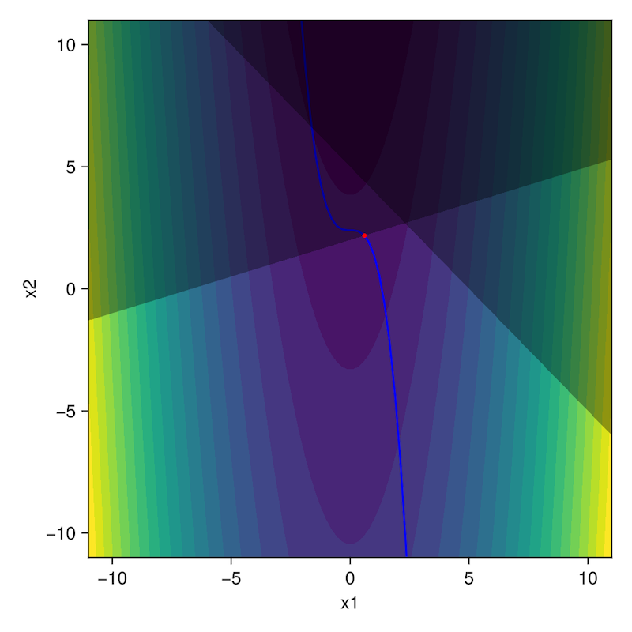

# Basics with `NLPSaUT.jl`

## A simple algebraic NLP

Let's suppose we would like to solve the following NLP

```math
\begin{aligned}
\min_{x_1,x_2} \quad& x_1^2 - x_2
\\\text{such that}\quad&
x_1^3 + x_2 - 2.4 = 0
\\&
x_1 + x_2 - 5 \leq 0
\\&
-0.3x_1 + x_2 - 2 \leq 0
\end{aligned}
```

We first import the necessary modules

```julia
using GLMakie
using Ipopt
using JuMP

push!(LOAD_PATH, joinpath(@__DIR__, "../src/"))
using NLPSaUT
```

We now define the problem dimension along with a fitness function that computes the objective, equality, and inequality constraints. 

```julia
# problem dimensions
nx = 2                   # number of decision vectors
nh = 1                   # number of equality constraints
ng = 2                   # number of inequality constraints
lx = -10*ones(nx,)       # lower bounds on decision variables
ux =  10*ones(nx,)       # upper bounds on decision variables
x0 = [-1.2, 10]          # initial guess

# fitness function
function f_fitness(x::T...) where {T<:Real}
	# objective
    f = x[1]^2 - x[2]
    
    # equality constraints
    h = zeros(T, 1)
    h = x[1]^3 + x[2] - 2.4

    # inequality constraints
    g = zeros(T, 2)
    g[1] = x[1] + x[2] - 5
    g[2] = -0.3x[1] + x[2] - 2
    return [f; h; g]
end
```

!!! tip
    When defining a fitness function, ensure the following:
    - The returned argument is a 1D array in order `f` (objective), `h` (equality constraints, if any), `g` (inequality constraints, if any).
    - Inequality constraints are provided the general form ``g(x) <= 0``.
    - The input argument signature is `f_fitness(x::T...) where {T<:Real}` - this is required as long as `ForwardDiff.jl` is to be used for gradients.
    - The input argument `x` is a 1D array

We can now construct a JuMP model. Here, we will use `Ipopt`.

```julia
model = NLPSaUT.build_model(Ipopt.Optimizer, f_fitness, nx, nh, ng, lx, ux, x0)
set_optimizer_attribute(model, "tol", 1e-12)
set_optimizer_attribute(model, "print_level", 5)
```

We can view the model via `println(model)`, which returns

```bash
Min fobj(x[1], x[2])
Subject to
 op_h_1(x[1], x[2]) - 0.0 = 0
 op_g_1(x[1], x[2]) - 0.0 ≤ 0
 op_g_2(x[1], x[2]) - 0.0 ≤ 0
 x[1] ≥ -10
 x[2] ≥ -10
 x[1] ≤ 10
 x[2] ≤ 10
```

and solve it!

```julia
optimize!(model)
```

We can check what we got

```julia
xopt = value.(model[:x])                # extract optimal decision
@assert is_solved_and_feasible(model)
println(termination_status(model))
println("Decision vector: ")
println(xopt)
println("Objective: ")
println(objective_value(model))
```

Let's visualize the results:

```julia
fig = Figure(size=(500,500))
ax = Axis(fig[1,1], xlabel="x1", ylabel="x2")
xs_grid = LinRange(-11, 11, 100)
ys_grid = LinRange(-11, 11, 100)
contourf!(ax, xs_grid, ys_grid, (x, y) -> f_fitness(x, y)[1], levels=20)

# plot constraints
lines!(ax, [x for x in xs_grid], [2.4 - x^3 for x in xs_grid], color=:blue)
fill_between!(ax, xs_grid, maximum(xs_grid) * ones(length(xs_grid)), 
    [0.3x + 2 for x in xs_grid], color=:black, alpha=0.35)
fill_between!(ax, xs_grid, maximum(xs_grid) * ones(length(xs_grid)), 
    [5 - x for x in xs_grid], color=:black, alpha=0.35)

# plot solution
scatter!(ax, [value(model[:x][1])], [value(model[:x][2])], markersize=5, color=:red)

# set bounds
xlims!(ax, minimum(xs_grid), maximum(xs_grid))
ylims!(ax, minimum(ys_grid), maximum(ys_grid))

display(fig)
```




## Fitness function with an `ODEProblem` inside

Let us now consider a trajectory design problem, where we need to integrate some dynamics. 
Specifically, we will consider the design of a phasing trajectory along a halo orbit with two impulses in the CR3BP dynamics. 
Let ``P`` denote the orbital period of the halo orbit; we wish to come back to the initial position ``r_0`` with a time of flight of ``0.9P``. 

Let ``\Delta v`` denote the initial maneuver vector, and ``\bar{r}`` and ``\bar{v}`` denote the initial position and velocity vecor along the halo orbit.
Mathematically (with a bit of abuse of notation), this can be written as

```math
\begin{aligned}
\min_{\Delta v} \quad& \| \Delta v \|_2 + \| \bar{v} - v(0.9P) \|_2
\\\text{such that}\quad&
\bar{r} - r(0.9P)
\end{aligned}
```

where ``r(0.9P)`` and ``v(0.9P)`` are the position and velocity vectors at time ``t = 0.9P``, obtained by solving the initial value problem

```math
\begin{aligned}
\dot{r} &= v
\\
\dot{v} &= -\dfrac{1-\mu}{\|r_1\|^3}r_1 - \dfrac{\mu}{\|r_2\|^3}r_2 - \omega \times (\omega \times r) - 2\omega \times r
\\
r(0) &= \bar{r}
\\
v(0) &= \bar{v} + \Delta v
\end{aligned}
```

with ``\omega = [0,0,1]^T``, ``r_1 = r - [-\mu,0,0]^T``, and ``r_2 = r - [1-\mu,0,0]^T``. 

We first load necessary modules, then define the dynamics in a compatible form to `OrdinaryDiffEq`

```julia
using GLMakie
using Ipopt
using JuMP
using LinearAlgebra
using OrdinaryDiffEq

include(joinpath(@__DIR__, "../src/NLPSaUT.jl"))

function cr3bp_rhs!(du,u,p,t)
    # unpack state
    x, y, z = u[1], u[2], u[3]
    vx, vy, vz = u[4], u[5], u[6]
    # compute distances
    r1 = sqrt( (x+p[1])^2 + y^2 + z^2 );
    r2 = sqrt( (x-1+p[1])^2 + y^2 + z^2 );
    # derivatives of positions
    du[1] = u[4]
    du[2] = u[5]
    du[3] = u[6]
    # derivatives of velocities
    du[4] = 2*vy + x - ((1-p[1])/r1^3)*(p[1]+x) + (p[1]/r2^3)*(1-p[1]-x);
    du[5] = -2*vx + y - ((1-p[1])/r1^3)*y - (p[1]/r2^3)*y;
    du[6] = -((1-p[1])/r1^3)*z - (p[1]/r2^3)*z;
    return
end
```

Let us define the initial conditions, period, and ``\mu`` for the CR3BP system

```julia
rv0 = [1.0809931218390707, 0.0, -2.0235953267405354E-01,
       0.0, -1.9895001215078018E-01, 0.0]
period_0 = 2.3538670417546639E+00
tspan = [0.0, 0.9*period_0]
μ = 1.215058560962404e-02
params_ode = [μ,]
```

We will now define a conveninence method for propagating the trajectory - this will be used inside the fitness function, as well as for plotting later on:

```julia
base_ode_problem = ODEProblem(cr3bp_rhs!, rv0, tspan, params_ode)

function get_trajectory(DV::T...) where {T<:Real}
    ode_problem = remake(base_ode_problem; u0 = rv0 + [0; 0; 0; DV...])
    sol = solve(ode_problem, Tsit5(); reltol = 1e-12, abstol = 1e-12)
    return sol
end
```

We are now ready to define our problem dimension & fitness function

```julia
nx = 3
nh = 3
ng = 0
lx = -0.5 * ones(nx,)
ux =  0.5 * ones(nx,)
x0 = [0.0, 0.0, 0.0]

function f_fitness(DV::T...) where {T<:Real}
    # integrate trajectory
    sol = get_trajectory(DV...)

    # final state deviation
    xf = sol.u[end]
    
	# objective
    f = norm(DV) + norm(rv0[4:6] - xf[4:6])
    
    # equality constraints for final state
    h = rv0[1:3] - xf[1:3]
    return [f; h]
end
```

Let's solve it!

```julia

# get model
order = 2
diff_f = "forward"
model = NLPSaUT.build_model(Ipopt.Optimizer, f_fitness, nx, nh, ng, lx, ux, x0; disable_memoize = false)
set_optimizer_attribute(model, "tol", 1e-12)
set_optimizer_attribute(model, "print_level", 5)
println(model)

# run optimizer
optimize!(model)
xopt = value.(model[:x])

# checks
@assert is_solved_and_feasible(model)
```

We can plot the resulting trajectory via

```julia
# plot
sol_initialguess = get_trajectory(x0...)
sol_optimal = get_trajectory(xopt...)

fig = Figure(size=(400,500))
ax = Axis3(fig[1,1]; aspect = :data, xlabel = "x", ylabel = "y", zlabel = "z")
scatter!(ax, [rv0[1]], [rv0[2]], [rv0[3]], markersize = 10, color = :red)
lines!(ax, Array(sol_initialguess)[1,:], Array(sol_initialguess)[2,:], Array(sol_initialguess)[3,:],
       color = :grey, label="Initial guess")
lines!(ax, Array(sol_optimal)[1,:], Array(sol_optimal)[2,:], Array(sol_optimal)[3,:],
       color = :red, label="Optimal two-impulse phasing trajectory")
axislegend(ax)
display(fig)
```


